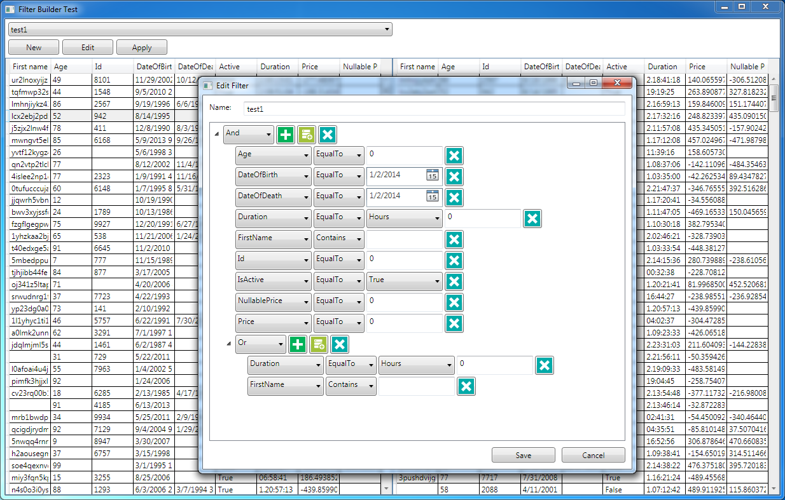
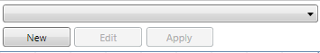
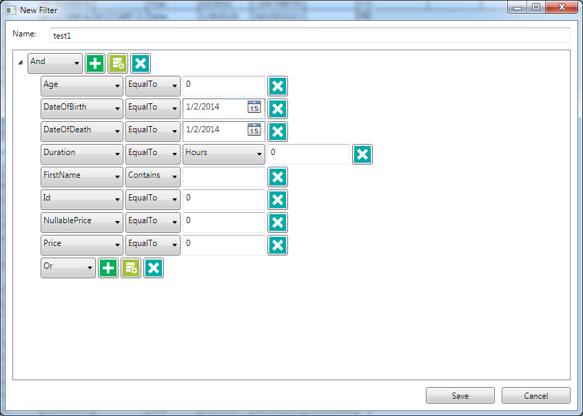
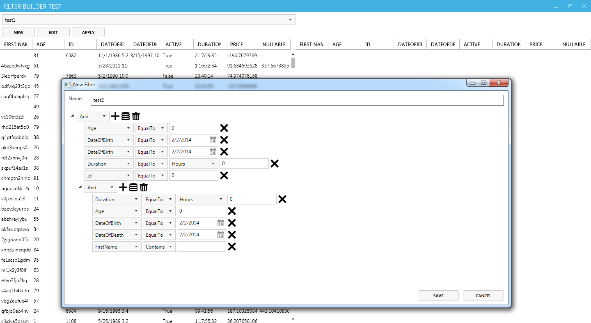
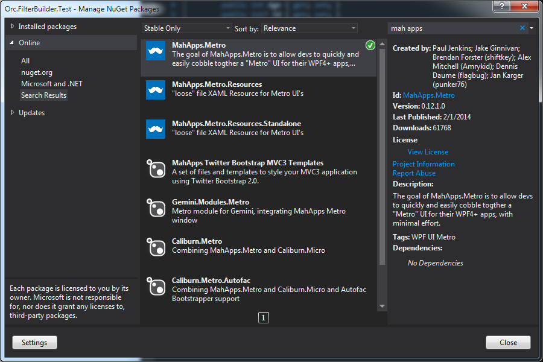
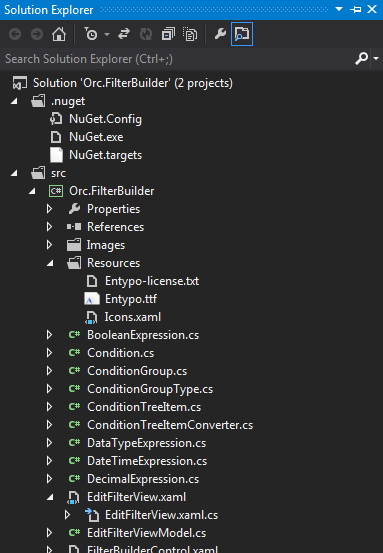
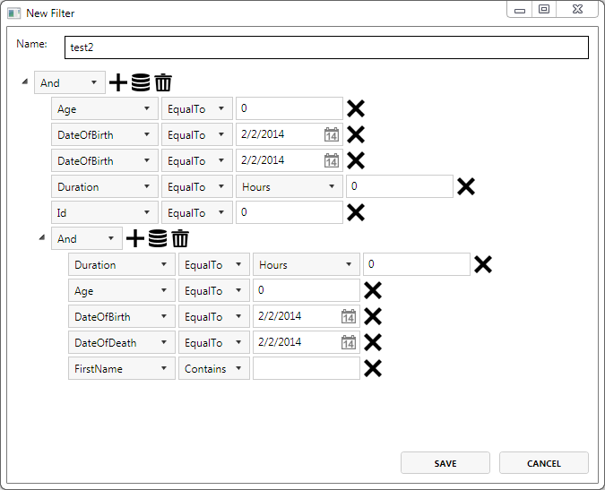

# Filter Builder

FilterBuilder is  WPF component which can help you extract key insights from your data, by adding complex filtering functionalities to your application.

 

## Usage

FilterBuilder is developer-friendly component which allows easy integration of complex data filtering functionality with new and existing enterprise applications. The component implementation only requires three steps.

1. Include the components project to your application
2. Create two object collections (input and output) 
3. Add FilterBuilder component to your application 

The component will automatically recognize the objects property types and provide the appropriate filtering options.

### Adding component project to your application

Before starting using the FilterBuilder please add the *Orc.FilterBuilder* project to your application.

### Create data collections

Two data collection should be created: one for input and one for filtered output:

    public ObservableCollection<TestEntity> RawItems { get; private set; }
    public ObservableCollection<TestEntity> FilteredItems { get; private set; }

### Adding component to your application

The control includes two Views (*FilterBuilderControl* and *EditFilterView*). 
*FilterBuilderControl* is responsible for invocation of *EditFilter* window and for implementing filtering of the main collection. 

  

Prior to using the component add the *FilterBuilder* namespace to your View:

    xmlns:net401="clr-namespace:Orc.FilterBuilder;assembly=Orc.FilterBuilder"

Next include the actual component to your View using the following code:

    <net401:FilterBuilderControl 
    			RawCollection="{Binding RawItems}"
    			FilteredCollection="{Binding FilteredItems}"/>

The *EditFilterView* is located in FilterBuilder project. It will show the filtering options window to the end user.

 

**Note:**
Before using the control please add Catel and Catel MVVM libraries to the project via nugget.

    Install-Package Catel.Core -Pre
    Install-Package Catel.MVVM -Pre

### Customizing component UI

The UI can easily be adjusted to any design. For example we will demonstrate how to apply the Metro UI theme.

 

Install the appropriate packages via nugget manager.

  

Or, through Package Manager Console using bellow commands:

    Install-Package MahApps.Metro –Pre
    Install-Package  MahApps.Metro.Resources.Standalone

First, modify the test project (*Orc.FilterBuilder.Test*) by adding the following code to the MainWindow.xaml header:

    <controls:MetroWindow x:Class="Orc.FilterBuilder.Test.NET40.MainWindow"
    		xmlns="http://schemas.microsoft.com/winfx/2006/xaml/presentation"
			xmlns:x="http://schemas.microsoft.com/winfx/2006/xaml"
    		xmlns:net401="clr-namespace:Orc.FilterBuilder;assembly=Orc.FilterBuilder"
    		xmlns:controls="clr-namespace:MahApps.Metro.Controls;assembly=MahApps.Metro"

Also, reference the Styles in the App.xaml file:

    <Application.Resources>
    	<ResourceDictionary>
    		<ResourceDictionary.MergedDictionaries>
    		<ResourceDictionary Source="pack://application:,,,/MahApps.Metro;component/Styles/Controls.xaml" />
    		<ResourceDictionary Source="pack://application:,,,/MahApps.Metro;component/Styles/Fonts.xaml" />
    		<ResourceDictionary Source="pack://application:,,,/MahApps.Metro;component/Styles/Colors.xaml" />
    		<ResourceDictionary Source="pack://application:,,,/MahApps.Metro;component/Styles/Accents/Blue.xaml" />
    		<ResourceDictionary Source="pack://application:,,,/MahApps.Metro;component/Styles/Accents/BaseLight.xaml" />
    		</ResourceDictionary.MergedDictionaries>
    	</ResourceDictionary>
    </Application.Resources>

Compile the sample project and you should see the basic Metro UI style applied to your application.

To customize the FilterBuilder Controller, reference the above libraries in the Orc.FilterBuilder project. 

  

Add Resources folder along with necessary files to the Control project.
Also, in the *EditFilterView.xaml* modify the ResourceDictionary section as follows:

    <ResourceDictionary>
    	<net40:ConditionTreeItemConverter x:Key="ConditionTreeItemConverter" />
    	<BooleanToVisibilityConverter x:Key="VisibilityConverter"/>
    	<net40:ValueControlTypeVisibilityConverter x:Key="ValueControlTypeVisibilityConverter"/>
    	<ResourceDictionary.MergedDictionaries>
    		<ResourceDictionary Source="Resources\Icons.xaml" />
    	</ResourceDictionary.MergedDictionaries>
    </ResourceDictionary>

To customize the style of the buttons add the *MetroCircleButtonStyle* and appropriate icon reference from the specified StaticResource (*appbar_add*) :

    <Button BorderThickness="0"  ToolTip="Add expression" Margin="3,0,0,0"
    									Command="{Binding DataContext.AddExpressionCommand, RelativeSource={RelativeSource Mode=FindAncestor, AncestorType=TreeView}}" 
    									CommandParameter="{Binding}"
     									Style="{DynamicResource MetroCircleButtonStyle}">
    	<Rectangle Width="20" Height="20">
    		<Rectangle.Fill>
    			<VisualBrush Stretch="Fill" Visual="{StaticResource appbar_add}" />
    		</Rectangle.Fill>
    	</Rectangle>
	</Button>

  

Compile the project, and enjoy!

## Links

FilterBuilder is part of the [Orchestra](https://github.com/WildGums/Orchestra) family of controls.
